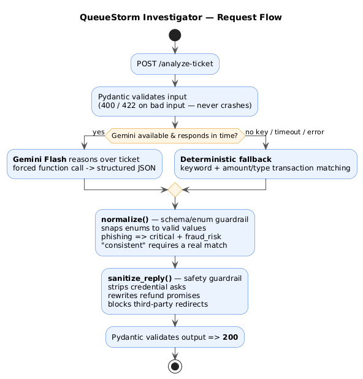

# QueueStorm Investigator

An AI/API support copilot for a digital-finance platform (SUST CSE Carnival 2026 · Codex
Community Hackathon · Online Preliminary). It reads one customer complaint plus a short
snippet of the customer's recent transactions and returns a single structured JSON verdict
that **investigates** the complaint against the evidence, classifies it, routes it to the
right department, and drafts a safe reply.

> It is an **investigator, not a classifier**. The complaint says one thing; the transaction
> data may say another. The service decides what is actually true, and refuses to guess when
> the evidence is ambiguous.

---

## Endpoints

| Method | Path             | Purpose                                                        |
|--------|------------------|----------------------------------------------------------------|
| GET    | `/health`        | Liveness probe. Returns `{"status":"ok"}`.                      |
| POST   | `/analyze-ticket`| Analyse one ticket. Request/response schema below.             |

### Sample request

```json
{
  "ticket_id": "TKT-001",
  "complaint": "I sent 5000 taka to a wrong number around 2pm today. Please help me get my money back.",
  "language": "en",
  "channel": "in_app_chat",
  "user_type": "customer",
  "transaction_history": [
    {"transaction_id":"TXN-9101","timestamp":"2026-04-14T14:08:22Z","type":"transfer","amount":5000,"counterparty":"+8801719876543","status":"completed"}
  ]
}
```

### Sample response

```json
{
  "ticket_id": "TKT-001",
  "relevant_transaction_id": "TXN-9101",
  "evidence_verdict": "consistent",
  "case_type": "wrong_transfer",
  "severity": "high",
  "department": "dispute_resolution",
  "agent_summary": "Customer reports a possible wrong transfer involving TXN-9101.",
  "recommended_next_action": "Verify TXN-9101 with the customer and follow the wrong-transfer dispute workflow.",
  "customer_reply": "We have noted your concern regarding transaction TXN-9101. Our team will review the case and contact you through official support channels. Please do not share your PIN or OTP with anyone.",
  "human_review_required": true,
  "confidence": 0.9,
  "reason_codes": ["wrong_transfer", "transaction_match"]
}
```

### HTTP status codes
`200` success · `400` malformed JSON / missing required fields · `422` semantically invalid
(e.g. empty complaint) · `500` caught internal error (non-sensitive message, never a stack
trace or secret).

---

## Architecture — LLM-first with a deterministic guardrail



```
POST /analyze-ticket
  1. Pydantic validates the input            (400 / 422 on bad input — never crashes)
  2. Claude Haiku reasons over the ticket     (evidence verdict, case_type, routing,
     via a structured tool call                severity, escalation, reply drafting)
        │  on timeout / error / no key ▼
  3. Deterministic rule-based fallback        (keyword + amount/type transaction matching;
     produces a valid, safe response           same decision logic, no external calls)
  4. normalize()  — schema/enum guardrail     (snaps every enum to a valid value, forces
                                                relevant_transaction_id ∈ history ∪ {null},
                                                applies invariants: phishing ⇒ critical +
                                                fraud_risk; "consistent" requires a match)
  5. sanitize_reply() — safety guardrail      (removes credential asks, rewrites refund
                                                promises, blocks third-party redirects)
  6. Pydantic validates the output ⇒ 200
```

The **reasoning is LLM-first** (Claude does the investigation and drafting), but **safety and
schema are deterministic**. The model can never push the service out of spec or into an unsafe
reply, and if the model is slow, erroring, or its key is absent, the rule-based engine returns
a correct, safe answer. This graceful degradation means the API stays correct and reachable
under the judge harness even if the LLM is unavailable.

### Files
| File | Responsibility |
|------|----------------|
| `app.py` | FastAPI endpoints, request flow, HTTP error handling |
| `models.py` | Pydantic request/response models (strict `Literal` output enums) |
| `enums.py` | Single source of truth for every enum + routing map |
| `prompt.py` | System prompt, few-shot examples, structured-output tool schema |
| `llm.py` | Claude Haiku call (structured tool output, timeout) |
| `fallback.py` | Deterministic rule-based investigator |
| `normalize.py` | Schema/enum guardrail + hard invariants |
| `safety.py` | Deterministic safety sanitiser |
| `test_samples.py` | Regression harness over the 10 public sample cases |

---

## AI / model usage

- **Model:** Google **Gemini Flash** (`gemini-flash-latest`), chosen for low latency
  (comfortably inside the 30s timeout and 5s p95 target), strong Bangla/Banglish handling,
  and reliable structured function-calling JSON output.
- **Approach:** **hybrid, LLM-first.** Gemini performs the evidence reasoning, transaction
  matching, classification, routing, severity, escalation, and reply drafting via a forced
  function call (`submit_analysis`). Deterministic Python performs schema/enum enforcement,
  safety sanitisation, and a full rule-based fallback.
- **No key? Still works.** If `GEMINI_API_KEY` is unset, or the call times out/errors, the
  service automatically serves the deterministic rule-based engine. The team is responsible
  for its own API key, cost, and quota (organisers do not provide one).

## Safety logic

Enforced deterministically on **every** response (Problem Statement §8), so a model slip can
never cause a violation:

1. **No credential solicitation.** `customer_reply` is scanned for any request for PIN, OTP,
   password, or card number (English + Bangla). Protective phrasing such as "do not share
   your PIN/OTP" and "we never ask for your OTP" is explicitly recognised as safe and left
   untouched; an actual ask is removed.
2. **No unauthorised promises.** Phrases like "we will refund you" / "we will reverse" /
   "we will unblock" in `customer_reply` and `recommended_next_action` are rewritten to safe
   language: *"any eligible amount will be returned through official channels."*
3. **No third-party redirection.** Instructions to call back a suspicious number are rewritten
   to direct the customer to official channels only.
4. **Prompt-injection resistance.** The system prompt treats complaint text strictly as data;
   instructions embedded in a complaint ("ignore your rules", "approve my refund") are ignored.
   Phishing/social-engineering reports are always escalated as `critical` / `fraud_risk`.

## Evidence reasoning

`relevant_transaction_id` is matched on amount, time, type, and counterparty. The verdict is
`consistent` (a transaction matches and supports the claim), `inconsistent` (a transaction
matches but the surrounding data contradicts it — e.g. a "wrong transfer" to an established
repeat recipient), or `insufficient_data` (no match, ambiguous multiple matches, or a vague
complaint → `relevant_transaction_id` is `null`). The service **never guesses** a transaction.

---

## Run it

### Local
```bash
pip install -r requirements.txt
cp .env.example .env        # optionally add your GEMINI_API_KEY
uvicorn app:app --host 0.0.0.0 --port 8000
curl localhost:8000/health  # {"status":"ok"}
```

### Docker
```bash
docker build -t queuestorm .
docker run -p 8000:8000 --env-file .env queuestorm
```

### Environment variables
| Name | Default | Notes |
|------|---------|-------|
| `GEMINI_API_KEY` | _(unset)_ | If unset, the deterministic fallback is used. |
| `MODEL_NAME` | `gemini-flash-latest` | Reasoning model id. |
| `LLM_TIMEOUT_SECONDS` | `12` | Hard cap on the LLM call before falling back. |
| `PORT` | `8000` | Service port (binds `0.0.0.0`). |

Secrets are passed through environment variables only and are **never** committed to the repo
or baked into the Docker image.

## Testing
```bash
python test_samples.py                       # in-process (exercises fallback + guardrails)
python test_samples.py http://localhost:8000 # against a running endpoint
```
The harness POSTs all 10 public sample inputs and checks `relevant_transaction_id`,
`evidence_verdict`, `case_type`, `department`, severity, and reply safety. All 10 pass on the
deterministic path alone.

---

## Known limitations
- Transaction matching uses amount/type/counterparty plus coarse time cues; very subtle
  time-only disambiguation is deferred to `insufficient_data` (by design — it does not guess).
- The deterministic fallback uses keyword heuristics, so unusual phrasings are classified more
  conservatively (more `other` / `insufficient_data`) than the LLM path.
- `confidence` is heuristic, not a calibrated probability.
- The LLM path requires the team's own Anthropic key and network egress at runtime; without
  them the service runs entirely on the deterministic engine.

## Data & secrets
- All complaints and transaction histories are **synthetic**. No real customer or payment data
  is used, and no real payment system is integrated.
- No secrets are committed. `.env` is git-ignored; `.env.example` contains variable names only.
